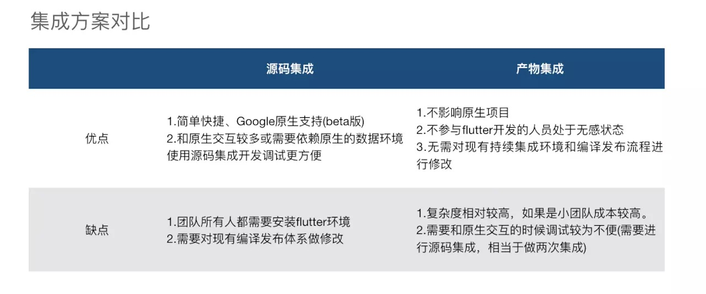

[toc]


# 原项目的配置

目前先搞定 iOS 的   

目前我依赖了一个 xq_test_two plugin


## podspec 依赖的 plugin

GeneratedPluginRegistrant.m

```object-c
#import "GeneratedPluginRegistrant.h"
#import <xq_test_two/XqTestTwoPlugin.h>

@implementation GeneratedPluginRegistrant

+ (void)registerWithRegistry:(NSObject<FlutterPluginRegistry>*)registry {
  [XqTestTwoPlugin registerWithRegistrar:[registry registrarForPlugin:@"XqTestTwoPlugin"]];
}

@end
```

xq_test_two 是 plugin, 这里注册这个第三方, 然后第三方会去监听通道, 完成它自己要完成的操作.

## podspec

```
# Uncomment this line to define a global platform for your project
# platform :ios, '9.0'

# CocoaPods analytics sends network stats synchronously affecting flutter build latency.
ENV['COCOAPODS_DISABLE_STATS'] = 'true'

project 'Runner', {
  'Debug' => :debug,
  'Profile' => :release,
  'Release' => :release,
}

def parse_KV_file(file, separator='=')
  file_abs_path = File.expand_path(file)
  if !File.exists? file_abs_path
    return [];
  end
  pods_ary = []
  skip_line_start_symbols = ["#", "/"]
  File.foreach(file_abs_path) { |line|
      next if skip_line_start_symbols.any? { |symbol| line =~ /^\s*#{symbol}/ }
      plugin = line.split(pattern=separator)
      if plugin.length == 2
        podname = plugin[0].strip()
        path = plugin[1].strip()
        podpath = File.expand_path("#{path}", file_abs_path)
        pods_ary.push({:name => podname, :path => podpath});
      else
        puts "Invalid plugin specification: #{line}"
      end
  }
  return pods_ary
end

target 'Runner' do
  # Prepare symlinks folder. We use symlinks to avoid having Podfile.lock
  # referring to absolute paths on developers' machines.
  system('rm -rf .symlinks')
  system('mkdir -p .symlinks/plugins')

  # Flutter Pods
  generated_xcode_build_settings = parse_KV_file('./Flutter/Generated.xcconfig')
  if generated_xcode_build_settings.empty?
    puts "Generated.xcconfig must exist. If you're running pod install manually, make sure flutter packages get is executed first."
  end
  generated_xcode_build_settings.map { |p|
    if p[:name] == 'FLUTTER_FRAMEWORK_DIR'
      symlink = File.join('.symlinks', 'flutter')
      File.symlink(File.dirname(p[:path]), symlink)
      pod 'Flutter', :path => File.join(symlink, File.basename(p[:path]))
    end
  }

  # Plugin Pods
  plugin_pods = parse_KV_file('../.flutter-plugins')
  plugin_pods.map { |p|
    symlink = File.join('.symlinks', 'plugins', p[:name])
    File.symlink(p[:path], symlink)
    pod p[:name], :path => File.join(symlink, 'ios')
  }
end

post_install do |installer|
  installer.pods_project.targets.each do |target|
    target.build_configurations.each do |config|
      config.build_settings['ENABLE_BITCODE'] = 'NO'
    end
  end
end

```


## Flutter 文件夹

Flutter 文件夹下 有两个 .framework

* App.framework
* Flutter.framework


> Flutter.framework 能直接 pod 'Flutter' 就有了, 总的来说, 只用导入 App.framework 就行??
> 然而测试下来...并不行, 当前的代码和 Flutter.framework , 是息息相关的.

AppFrameworkInfo.plist

```xml
<?xml version="1.0" encoding="UTF-8"?>
<!DOCTYPE plist PUBLIC "-//Apple//DTD PLIST 1.0//EN" "http://www.apple.com/DTDs/PropertyList-1.0.dtd">
<plist version="1.0">
<dict>
  <key>CFBundleDevelopmentRegion</key>
  <string>en</string>
  <key>CFBundleExecutable</key>
  <string>App</string>
  <key>CFBundleIdentifier</key>
  <string>io.flutter.flutter.app</string>
  <key>CFBundleInfoDictionaryVersion</key>
  <string>6.0</string>
  <key>CFBundleName</key>
  <string>App</string>
  <key>CFBundlePackageType</key>
  <string>FMWK</string>
  <key>CFBundleShortVersionString</key>
  <string>1.0</string>
  <key>CFBundleSignature</key>
  <string>????</string>
  <key>CFBundleVersion</key>
  <string>1.0</string>
  <key>MinimumOSVersion</key>
  <string>8.0</string>
</dict>
</plist>

```


> 导入Generated.xcconfig配置，这些配置都为环境变量配置，主要为构建阶段xcode_backend.sh脚本执行做准备

Debug.xcconfig

```
#include "Pods/Target Support Files/Pods-Runner/Pods-Runner.debug.xcconfig"
#include "Generated.xcconfig"

```

Release.xcconfig

```
// 导入
#include "Pods/Target Support Files/Pods-Runner/Pods-Runner.release.xcconfig"
#include "Generated.xcconfig"

```

Generated.xcconfig

```
// This is a generated file; do not edit or check into version control.
FLUTTER_ROOT=/Users/wangxingqian/flutter // flutter 位置
FLUTTER_APPLICATION_PATH=/Users/wangxingqian/Desktop/Flutter/Flutter学习/Hybrid/xq_hybrid_demo // 当前项目位置
FLUTTER_TARGET=/Users/wangxingqian/Desktop/Flutter/Flutter学习/Hybrid/xq_hybrid_demo/lib/main.dart // main.dart位置
FLUTTER_BUILD_DIR=build // build 位置
SYMROOT=${SOURCE_ROOT}/../build/ios // 源码文件位置???
FLUTTER_FRAMEWORK_DIR=/Users/wangxingqian/flutter/bin/cache/artifacts/engine/ios // Flutter.framework位置
FLUTTER_BUILD_NAME=1.0.0 // 构建版本
FLUTTER_BUILD_NUMBER=1 // 构建编号
TRACK_WIDGET_CREATION=true // 跟踪小部件??? 是否是 Release 时要设为 false ?

```


Pods-Runner.debug.xcconfig 和 Pods-Runner.release.xcconfig 是一样的  
这里大致就是让指定pod查找的路径, 还有设置一些参数等等

```
FRAMEWORK_SEARCH_PATHS = $(inherited) "${PODS_ROOT}/../.symlinks/flutter/ios"
GCC_PREPROCESSOR_DEFINITIONS = $(inherited) COCOAPODS=1
HEADER_SEARCH_PATHS = $(inherited) "${PODS_ROOT}/Headers/Public" "${PODS_ROOT}/Headers/Public/xq_test_two"
LD_RUNPATH_SEARCH_PATHS = $(inherited) '@executable_path/Frameworks' '@loader_path/Frameworks'
LIBRARY_SEARCH_PATHS = $(inherited) "${PODS_CONFIGURATION_BUILD_DIR}/xq_test_two"
OTHER_LDFLAGS = $(inherited) -ObjC -l"xq_test_two" -framework "Flutter"
PODS_BUILD_DIR = ${BUILD_DIR}
PODS_CONFIGURATION_BUILD_DIR = ${PODS_BUILD_DIR}/$(CONFIGURATION)$(EFFECTIVE_PLATFORM_NAME)
PODS_PODFILE_DIR_PATH = ${SRCROOT}/.
PODS_ROOT = ${SRCROOT}/Pods

```


## Targets -> Build Phases

Run Script 

```
/bin/sh "$FLUTTER_ROOT/packages/flutter_tools/bin/xcode_backend.sh" build
```

Thin Binary

```
/bin/sh "$FLUTTER_ROOT/packages/flutter_tools/bin/xcode_backend.sh" thin
```


## 一些其他配置

### Build System

File > Project Settings -> Shared Workspace Settings -> Build System


经测试, 好像这个并不用???


### bitcode

bitcode -> NO


## 总结整个编译过程


# 两种 Hybrid 方式


目前主流的混合开发方案有两种集成方式：  
1. 源码集成： 也就是谷歌官方提供的方案 [https://github.com/flutter/flutter/wiki/Add-Flutter-to-existing-apps]
2. 产物集成： Flutter项目单独开发，开发完成后发布成aar包或者iOS的framework形式，原生项目依赖flutter输出的制品即可。具体可以参考闲鱼的文章 [https://www.yuque.com/xytech]





# 坑


## Failed to find snapshot:....

```
2019-05-14 17:00:42.507393+0800 XQFlutterHybridDemo[28660:9824741] Failed to find snapshot: /var/containers/Bundle/Application/B26D4488-168D-4D40-B07A-245D24717C69/XQFlutterHybridDemo.app/Frameworks/App.framework/flutter_assets/kernel_blob.bin
2019-05-14 17:00:42.518154+0800 XQFlutterHybridDemo[28660:9824741] [VERBOSE-3:dart_vm.cc(416)] Error while initializing the Dart VM: Wrong full snapshot version, expected '0c73eb70aa4d30f450273cb424be8c62' found '063c66cf3ae51e48c330780656345989'
```

不要用 CocoaPods 上面的Flutter, 要用自己本地打包出来的Flutter..

```
pod 'Flutter'
```


## 内存泄露问题

https://juejin.im/post/5c24ad306fb9a049d2361cff

总体来说就是

1. 原来是 FlutterViewController 内存泄露, 后来官方 1.0 版本修复了
2. 自己持有 FlutterEngine, 在不需要的时候, 调用 destroyContext 方法, 释放内存.

> 经测试, 就算调用了 destroyContext 也会一样会有一部分内存没释放, 不过相对来说, 已经好很多了. 


